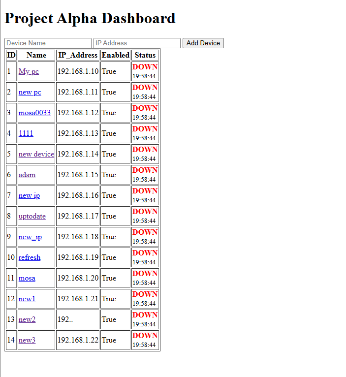
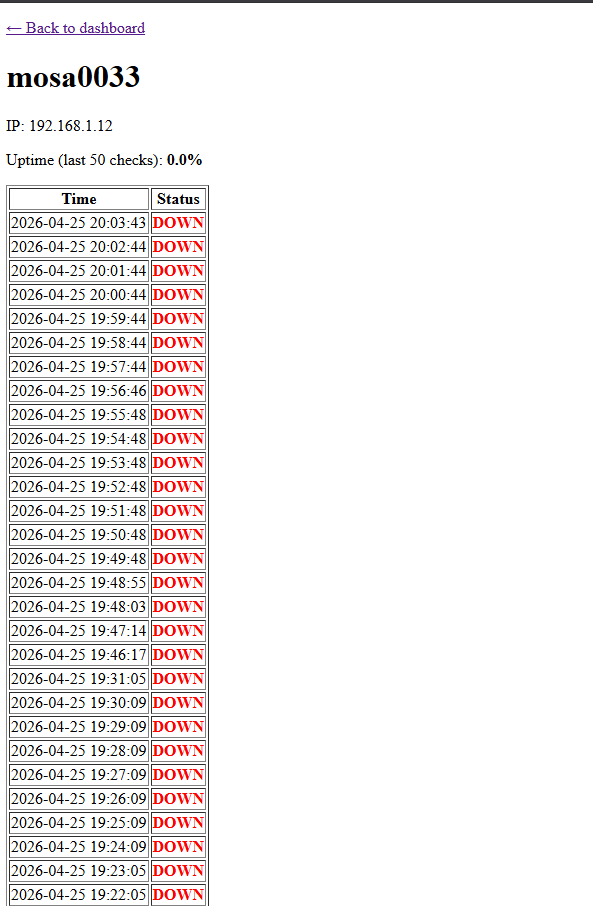

# Project Alpha — Home Network Monitor

A FastAPI web app that pings devices on your home network every 60 seconds,
stores results in SQLite, and shows live UP/DOWN status plus per-device
uptime history on a dashboard.

Built as a portfolio project to practice full-stack Python: ORM modeling,
background scheduling, and server-rendered templates.

## Screenshots

### Dashboard


### Device history


## Features

- Add devices via a web form (name + IP address)
- Background scheduler pings every enabled device every 60 seconds
- Immediate first ping when a device is added — no "Pending" wait
- Live dashboard shows latest UP/DOWN status and last-checked time
- Per-device history page with uptime % over the last 50 checks
- SQLite storage — no external database to install

## Tech stack

- **FastAPI** — async Python web framework with automatic request validation
- **SQLAlchemy** — ORM for the `Device` and `Check` tables
- **SQLite** — zero-config local database, file stored as `alpha.db`
- **APScheduler** — runs the ping job on a 60-second interval
- **Jinja2** — server-rendered HTML templates

## Setup

Requires **Python 3.11+** on **Windows** (the ping logic uses the Windows
`ping -n 1` command — see *Known limitations* for cross-platform notes).

```bash
git clone https://github.com/MohammadSalam1/Project_Alpha.git
cd project-alpha

python -m venv .venv
.venv\Scripts\activate

pip install -r requirements.txt

uvicorn main:app --reload
```

Open http://127.0.0.1:8000 in your browser.

The SQLite database (`alpha.db`) is created automatically on first run.

## Project structure

```
project-alpha/
├── main.py            # FastAPI routes, scheduler, ping function
├── database.py        # SQLAlchemy models and session factory
├── templates/
│   ├── index.html     # Dashboard (device list + add form)
│   └── device.html    # Per-device history page
├── requirements.txt
└── alpha.db           # SQLite file, created on first run
```

## How it works

1. **Add a device** — the form on `/` POSTs to `/add-device`, which inserts
   a row into the `devices` table and runs an immediate ping so the
   dashboard shows status right away.
2. **Background scan** — APScheduler runs `scan_devices()` every 60 seconds:
   loops through every enabled device, pings it, and writes one row to the
   `checks` table per result.
3. **Dashboard** — `GET /` queries every device, attaches its most recent
   `Check` row, and renders the table with UP/DOWN coloring.
4. **History** — `GET /devices/{id}` shows the last 50 checks for one
   device plus uptime % over that window.

## Known limitations

- Windows-only ping (`ping -n 1`); Linux/macOS would need `ping -c 1`
- Timestamps are stored in UTC and displayed without timezone conversion
- No authentication — intended for local use only
- No edit/delete devices yet
- The `checks` table grows indefinitely (~1,440 rows/device/day)

## Roadmap

- [ ] Cross-platform ping (detect OS at runtime)
- [ ] Response time (ms) per check, not just up/down
- [ ] Uptime chart on the history page (Chart.js)
- [ ] Edit and delete devices from the UI
- [ ] Dockerfile for one-command deploy
- [ ] Periodic cleanup of old `checks` rows


